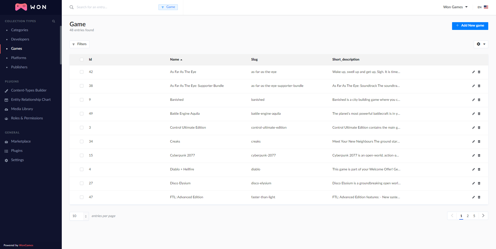

<p align="center">
  
  <br/>
  
</p>  
  
# Won Games Api

Won Games Api using Strapi, PostgreSQL, and Node.JS. 

## Getting Started

These instructions will get you a copy of the project up and running on your local machine for development and testing purposes. See deployment for notes on how to deploy the project on a live system.

### Prerequisites

1. Node.JS
2. PostgreSQL

### Installing

A step by step series of examples that tell you how to get a development env running

Clone the repo
```
git clone https://github.com/georgekaran/won-games-api.git
```

Creating a PostgreSQL user and database:

```sql
  CREATE USER wongames WITH ENCRYPTED PASSWORD 'wongames123';
  CREATE DATABASE wongames OWNER wongames;
  -- Or choose a different name and change the file config/database.js
```

Install the dependencies and run the app.
```
npm i
npm run develop
```

## Deployment

Add additional notes about how to deploy this on a live system

## Built With

* [Node.JS](https://nodejs.org/en/docs/) - Javascript runtime.
* [PostgresSQL](https://docs.mongodb.com/) - SQL database.
* [Strapi](https://strapi.io/) - Strapi is the leading open-source headless
CMS. It’s 100% Javascript, fully customizable, and
developer-first.

## Acknowledgments

* Code built following the course [React Avançado](https://www.udemy.com/course/react-avancado) by Willian Justen de Vasconcellos and Guilherme Louro
